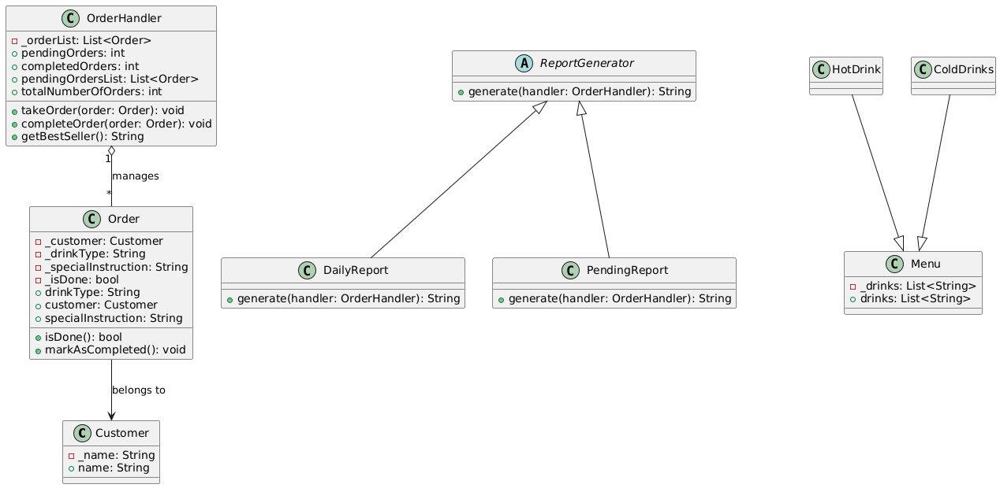
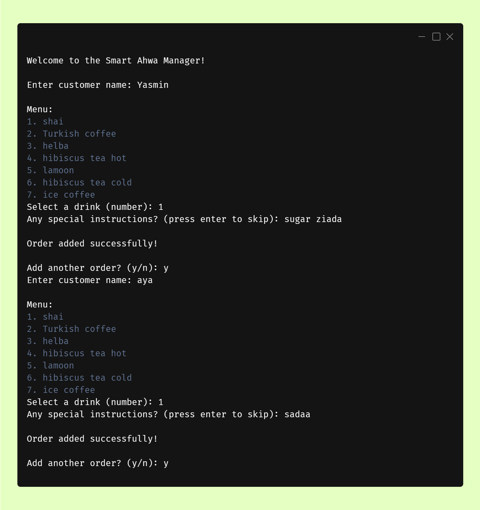
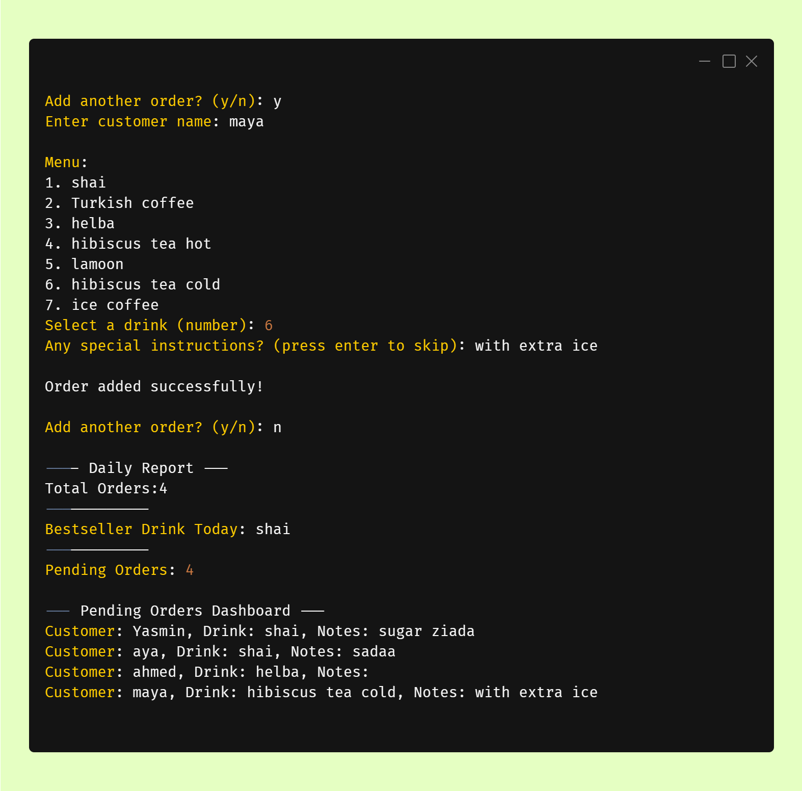
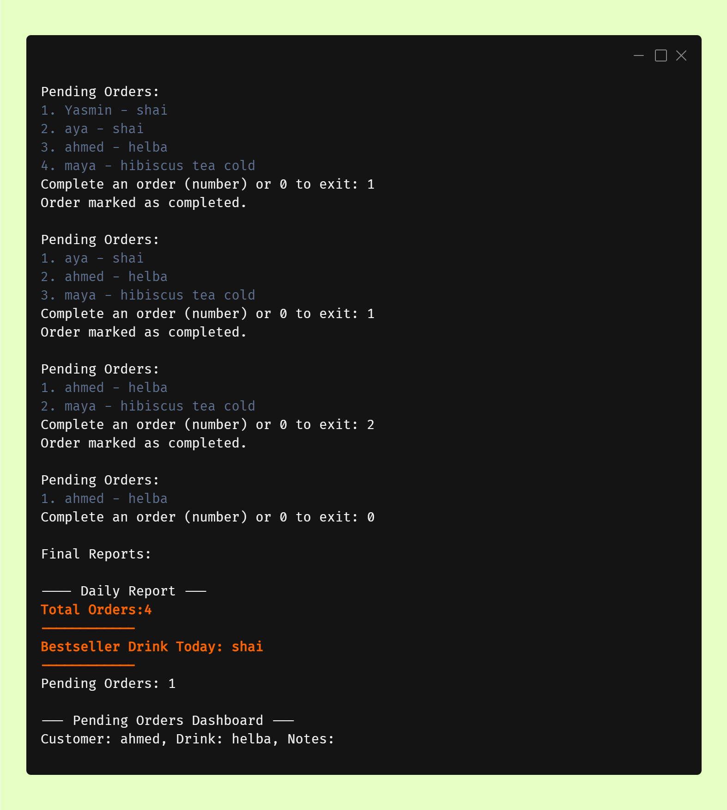

# ☕ Smart Ahwa Manager

A simple console-based Flutter/Dart application for managing orders in a traditional Egyptian café (Ahwa).
This project applies **SOLID principles** and object-oriented design to handle order management, reporting, and future extensibility.

---

## 📌 Features

* Add new orders with **customer name**, **drink type**, and **special instructions**
* Track **pending** and **completed** orders
* Generate different reports:

    * Daily Report (all orders)
    * Top Seller Report (most popular drink)
* Modular design that separates **business logic** (OrderHandler) from **reports**.

---

## 📊 Class Diagram

> Diagram showing the relationship between `Order`, `OrderHandler`, `ReportGenerator`, and different reports.



---

## 🖥️ Example Output

| Start and take order           | pending dashboard                | Handel Orders & final reports  |
|--------------------------------|----------------------------------|--------------------------------|
|  |  |  | 
---

## 📚 What I Learned

Through this project, I practiced applying **SOLID principles** to build a clean and maintainable design.

* **Single Responsibility Principle (SRP):** Each class (`Order`, `OrderHandler`, `ReportGenerator`) has a clear, single responsibility.
* **Open/Closed Principle (OCP):** New reports (e.g., `TopSellerReport`, `DailyReport`) can be added without modifying existing code.
* **Dependency Inversion Principle (DIP):** The `OrderHandler` depends on the `ReportGenerator` interface instead of concrete reports, making it easier to extend or swap implementations.

This links to **The Object-Oriented Thought Process** because the system demonstrates **modularity, abstraction, and extensibility**, showing how small, well-defined components can interact while remaining loosely coupled.

---

## 🚀 How to Run

1. Install Dart SDK
2. Clone the repository
3. Run in terminal:

   ```bash
   dart run main.dart
   ```

---
"# Smart-Ahwa-Manager" 
